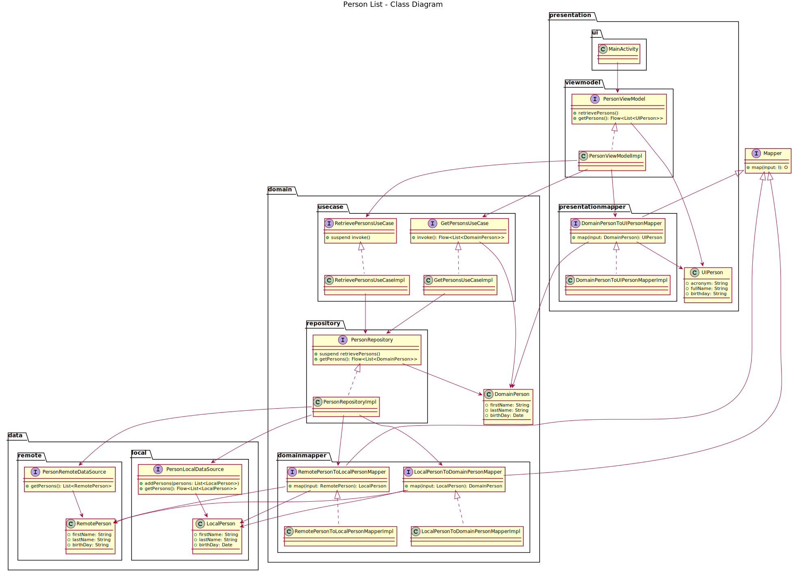

# Person List

This app is created to show some best practices in action.

## App Architecture

The app architecture includes:
- MVVM as presentation pattern
- Clean Architecture layers
- Repository and Data Source patterns to interact with the remote and local data
- Mapper pattern to convert DTO (Data transfer object) from inner layers to upper layers
- Coroutines as reactive programming

### Person List - Class Diagram




## Testing

TDD (Test Driven Development) was used in each feature of this app.

For testing purpose, this project implements [Mockk.io](https://mockk.io/) that is adapted to kotlin.

Each Test has the next structure:
```kotlin
fun someFunctionShouldCallAnotherFunctionOnSomeClassGivenThisFunctionOnSomeDependencyObjectReturnsRandomValue() {
    // Given
    val randomValue = Random.nextValue()
    every { someDependency.thisFunction() } returns randomValue

    // When
    objectToBeTested.someFunction()

    // Then
    verify { someClass.anotherFunction() }
}
```

Describing the name of the test you will see next elements:
- When section: Represents the function or event you are testing. Each test start with this section following a human description.
- Then section: Represents the assert of the test. The validation is described as `should call` or `should return`, explaining what should occur after when is occurs.
- Given section: Represents the preconditions or inputs of the test. Similar to `before each test`, but this section is only what this test should set up before when occurs.

Example:
```kotlin
fun whenThenGiven() {
    // Given
    // When
    // Then
}
```

## Development Lifecycle

1. Design Review.
2. Skeleton Classes.
3. UI Tests with mock ViewModels.
4. ViewModel unit tests with mock dependencies.
5. UseCase unit tests with mock dependencies.
6. Repository unit tests with mock dependencies.
7. LocalDataSource instrumented tests with no mock.
8. RemoteDataSource mock server tests.
9. Mapper unit tests. Each layer could contain mappers.
10. Instrumented tests per use case with no mock dependencies.

## Test lifecycle

1. Write a test that fail.
2. Write the minimum code needed to pass the test.
3. Refactor your test and/or your implementation following code best practices.
4. Write next test that fail.
 
NOTE: It is intended to see that the test is failing before the implemented is coded. So that, you
are sure the test is validating what you are expecting.
NOTE: You need to ensure that you don't write more test than needed in each step.